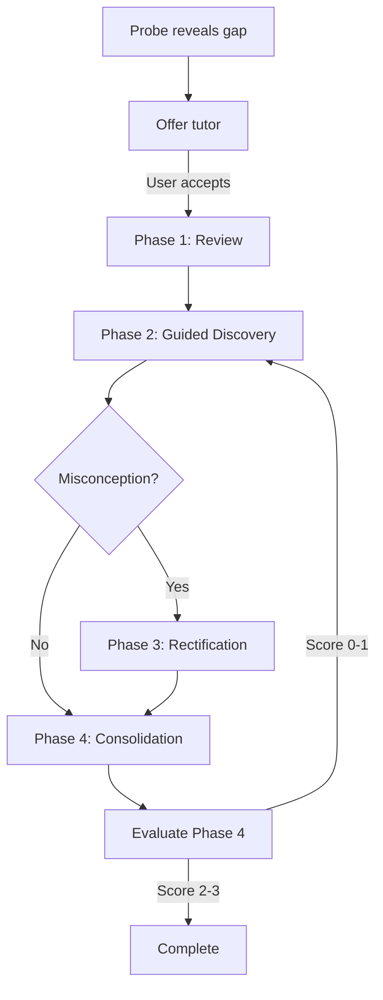

The tutor engine orchestrates a 4-phase Socratic dialogue to deepen conceptual understanding. It's triggered when a probe reveals a gap in understanding (score 0-1) or when the user explicitly requests help.

## Core Function

### generateTutorQuestion

Generate the next tutor question based on the current phase and conversation history.

<ParamField path="prompt" type="string" required>
  Complete tutor prompt built using one of the phase builders:
  - `buildPhase1Prompt` (Review)
  - `buildPhase2Prompt` (Guided Discovery)
  - `buildPhase3Prompt` (Rectification)
  - `buildPhase4Prompt` (Consolidation)
</ParamField>

<ResponseField name="ParsedTutorResponse" type="object">
  <Expandable title="properties">
    <ResponseField name="question" type="string">
      The next tutor question (1-2 sentences, Socratic style)
    </ResponseField>
    <ResponseField name="misconceptionDetected" type="string | null">
      Detected misconception, if any
    </ResponseField>
  </Expandable>
</ResponseField>

```typescript tutor-engine.ts
import { generateTutorQuestion, buildPhase1Prompt } from '@entendi/core';

const prompt = buildPhase1Prompt({
  conceptName: 'React useEffect',
  triggerContext: 'User wrote: useEffect(() => { fetchData(); }, [])'
});

const response = await generateTutorQuestion(prompt);
console.log(response.question);
// "What do you already know about useEffect and how it manages side effects in React?"
```

## Phase Prompt Builders

### buildPhase1Prompt

**Phase 1: Review** — Assess what the learner already knows before guided discovery begins.

<ParamField path="input" type="object" required>
  <Expandable title="properties">
    <ParamField path="conceptName" type="string" required>
      Name of the concept to teach
    </ParamField>
    <ParamField path="triggerContext" type="string" required>
      Context in which the gap was detected
    </ParamField>
  </Expandable>
</ParamField>

<ResponseField name="string" type="string">
  Complete Phase 1 prompt for Claude
</ResponseField>

```typescript tutor-engine.ts
import { buildPhase1Prompt, generateTutorQuestion } from '@entendi/core';

const prompt = buildPhase1Prompt({
  conceptName: 'OAuth 2.0 client credentials flow',
  triggerContext: 'User attempted to implement but passed wrong grant_type'
});

const response = await generateTutorQuestion(prompt);
// Diagnostic question to establish baseline understanding
```

### buildPhase2Prompt

**Phase 2: Guided Discovery** — Push toward deeper understanding through guided questioning.

<ParamField path="input" type="object" required>
  <Expandable title="properties">
    <ParamField path="conceptName" type="string" required>
      Name of the concept
    </ParamField>
    <ParamField path="exchanges" type="TutorExchangeInput[]" required>
      All exchanges so far (Phase 1 + any Phase 2)
    </ParamField>
  </Expandable>
</ParamField>

<ResponseField name="string" type="string">
  Complete Phase 2 prompt for Claude
</ResponseField>

```typescript tutor-engine.ts
import { buildPhase2Prompt, generateTutorQuestion } from '@entendi/core';

const prompt = buildPhase2Prompt({
  conceptName: 'React useEffect',
  exchanges: [
    {
      phase: 'phase1',
      question: 'What do you know about useEffect?',
      response: 'It runs side effects in React components.'
    }
  ]
});

const response = await generateTutorQuestion(prompt);
// Question guiding toward deeper principle (e.g., timing, cleanup)
```

### buildPhase3Prompt

**Phase 3: Rectification** — Correct misconceptions through Socratic questioning.

<ParamField path="input" type="object" required>
  <Expandable title="properties">
    <ParamField path="conceptName" type="string" required>
      Name of the concept
    </ParamField>
    <ParamField path="exchanges" type="TutorExchangeInput[]" required>
      All exchanges so far
    </ParamField>
    <ParamField path="misconception" type="string">
      Specific misconception to address (if detected)
    </ParamField>
  </Expandable>
</ParamField>

<ResponseField name="string" type="string">
  Complete Phase 3 prompt for Claude
</ResponseField>

```typescript tutor-engine.ts
import { buildPhase3Prompt, generateTutorQuestion } from '@entendi/core';

const prompt = buildPhase3Prompt({
  conceptName: 'React useEffect',
  exchanges: [
    {
      phase: 'phase1',
      question: 'What do you know about useEffect?',
      response: 'It runs after every render.'
    },
    {
      phase: 'phase2',
      question: 'How can you control when it runs?',
      response: 'By adding things to the dependency array.'
    }
  ],
  misconception: 'User thinks useEffect always runs after every render'
});

const response = await generateTutorQuestion(prompt);
// Question exposing the flaw (e.g., "What happens if you pass an empty array?")
```

### buildPhase4Prompt

**Phase 4: Consolidation** — Summative assessment asking for integrated explanation.

<ParamField path="input" type="object" required>
  <Expandable title="properties">
    <ParamField path="conceptName" type="string" required>
      Name of the concept
    </ParamField>
    <ParamField path="exchanges" type="TutorExchangeInput[]" required>
      All exchanges (Phase 1-3)
    </ParamField>
  </Expandable>
</ParamField>

<ResponseField name="string" type="string">
  Complete Phase 4 prompt for Claude
</ResponseField>

```typescript tutor-engine.ts
import { buildPhase4Prompt, generateTutorQuestion } from '@entendi/core';

const prompt = buildPhase4Prompt({
  conceptName: 'React useEffect',
  exchanges: [
    // ... all previous exchanges
  ]
});

const response = await generateTutorQuestion(prompt);
// "Can you now explain the full picture of how useEffect manages side effects?"
```

## Response Parser

### parseTutorResponse

Parse LLM response into structured tutor response. Handles JSON extraction and provides fallback parsing.

<ParamField path="raw" type="string" required>
  Raw LLM response text
</ParamField>

<ResponseField name="ParsedTutorResponse" type="object">
  Parsed response with question and optional misconception
</ResponseField>

```typescript tutor-engine.ts
import { parseTutorResponse } from '@entendi/core';

const rawResponse = `
{"question": "What would happen if you didn't include cleanup?", "misconceptionDetected": "User doesn't understand cleanup functions"}
`;

const parsed = parseTutorResponse(rawResponse);
console.log(parsed.question);
console.log(parsed.misconceptionDetected);

// Fallback for malformed JSON
const malformed = 'The question is: "Why did you choose this approach?"';
const fallback = parseTutorResponse(malformed);
console.log(fallback);
// { question: "Why did you choose this approach?", misconceptionDetected: null }
```

## Type Definitions

```typescript types.ts
export interface TutorExchangeInput {
  phase: string;
  question: string;
  response: string | null;
}

export interface ParsedTutorResponse {
  question: string;
  misconceptionDetected: string | null;
}

export type TutorPhase = 'offered' | 'phase1' | 'phase2' | 'phase3' | 'phase4' | 'complete';

export interface TutorExchange {
  phase: TutorPhase;
  question: string;
  response: string | null;
}

export interface TutorSession {
  sessionId: string;
  conceptId: string;
  phase: TutorPhase;
  startedAt: string;
  lastActivityAt: string;
  triggerProbeScore: RubricScore | null;
  exchanges: TutorExchange[];
  phase1Score: RubricScore | null;
  phase4Score: RubricScore | null;
  lastMisconception: string | null;
}
```

## Phase Workflow



## Complete Example

```typescript example.ts
import {
  generateTutorQuestion,
  buildPhase1Prompt,
  buildPhase2Prompt,
  buildPhase3Prompt,
  buildPhase4Prompt,
  parseTutorResponse,
  type TutorExchangeInput,
  type ParsedTutorResponse
} from '@entendi/core';

interface TutorState {
  conceptName: string;
  triggerContext: string;
  exchanges: TutorExchangeInput[];
  currentPhase: 'phase1' | 'phase2' | 'phase3' | 'phase4';
  misconception: string | null;
}

async function advanceTutor(
  state: TutorState,
  userResponse: string | null
): Promise<ParsedTutorResponse> {
  // Add user's response to the last exchange
  if (userResponse && state.exchanges.length > 0) {
    state.exchanges[state.exchanges.length - 1].response = userResponse;
  }
  
  // Build prompt based on current phase
  let prompt: string;
  
  switch (state.currentPhase) {
    case 'phase1':
      prompt = buildPhase1Prompt({
        conceptName: state.conceptName,
        triggerContext: state.triggerContext
      });
      break;
      
    case 'phase2':
      prompt = buildPhase2Prompt({
        conceptName: state.conceptName,
        exchanges: state.exchanges
      });
      break;
      
    case 'phase3':
      prompt = buildPhase3Prompt({
        conceptName: state.conceptName,
        exchanges: state.exchanges,
        misconception: state.misconception || undefined
      });
      break;
      
    case 'phase4':
      prompt = buildPhase4Prompt({
        conceptName: state.conceptName,
        exchanges: state.exchanges
      });
      break;
  }
  
  // Generate next question
  const response = await generateTutorQuestion(prompt);
  
  // Track misconceptions
  if (response.misconceptionDetected) {
    state.misconception = response.misconceptionDetected;
  }
  
  // Add new exchange
  state.exchanges.push({
    phase: state.currentPhase,
    question: response.question,
    response: null
  });
  
  return response;
}

// Usage
const state: TutorState = {
  conceptName: 'React useEffect',
  triggerContext: 'User wrote: useEffect(() => { fetchData(); }, [])',
  exchanges: [],
  currentPhase: 'phase1',
  misconception: null
};

// Phase 1: Review
const q1 = await advanceTutor(state, null);
console.log('[Phase 1]', q1.question);

// User responds
state.currentPhase = 'phase2';
const q2 = await advanceTutor(state, "It runs side effects in React.");
console.log('[Phase 2]', q2.question);

if (q2.misconceptionDetected) {
  console.log('Misconception detected:', q2.misconceptionDetected);
  state.currentPhase = 'phase3';
}

// Continue through phases...
```

## Tutor System Instruction

All phase prompts use this shared system instruction:

```typescript tutor-engine.ts
const TUTOR_SYSTEM = `You are a Socratic tutor helping a developer deepen their understanding of a concept they encountered during AI-assisted coding. Your goal is to guide them toward genuine comprehension through dialogue, not to lecture.

Guidelines:
- Ask one focused question at a time
- Build on the learner's previous answers
- If you detect a misconception, note it but guide toward correction rather than stating the answer directly
- Keep questions concise (1-2 sentences)
- Respond with a single JSON object (no markdown, no extra text):
{"question": "Your question here", "misconceptionDetected": "description of misconception" | null}`;
```

## Configuration

```typescript tutor-engine.ts
const MODEL = 'claude-haiku-4-5-20251001';
const MAX_TOKENS = 400;
```

The Anthropic client is lazy-initialized and reused. Set `ANTHROPIC_API_KEY` in your environment.

## Integration with Tutor Session State Machine

The tutor engine handles prompt generation and parsing. For full session management, use it with the tutor session state machine:

```typescript
import { advanceTutorPhase, isTutorActive, shouldOfferTutor } from '@entendi/core';

// Check if tutor should be offered after probe
if (shouldOfferTutor(probeScore, userPreferences)) {
  // Offer tutor to user...
}

// Advance through phases
const updated = advanceTutorPhase(session, userResponse, evaluation);
```

See [Tutor Session State Machine](/api/state/tutor-session) for full session lifecycle management.
