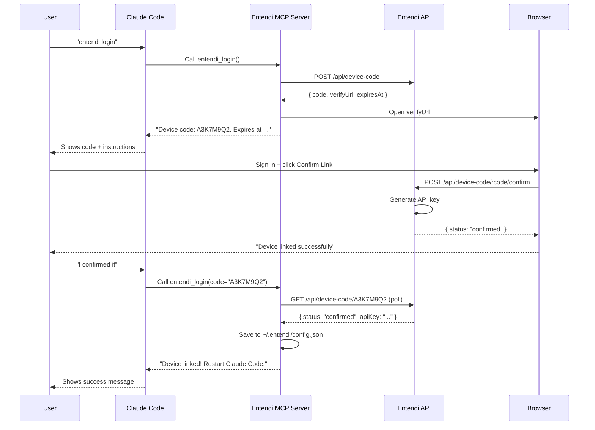

Entendi uses a **device code flow** to authenticate CLI clients without requiring you to paste API keys manually. This guide explains how it works under the hood.

## Overview

The device code flow is a two-phase OAuth-style authentication:

1. **Phase 1** — Generate a device code and open a browser for the user to confirm
2. **Phase 2** — Poll the server for confirmation and retrieve an API key

This pattern is secure for CLI tools because:
- No credentials are pasted into the terminal
- The API key is generated server-side and transmitted once
- Device codes expire after 10 minutes if not confirmed

## Flow Diagram



## Phase 1: Create Device Code

When you say `"entendi login"` in Claude Code:

<Steps>
  <Step title="Hook detects login pattern">
    The `UserPromptSubmit` hook (`src/hooks/user-prompt-submit.ts:23`) matches your message against these regex patterns:
    
    ```typescript
    const LOGIN_PATTERNS = [
      /entendi\s+log\s*in/i,
      /entendi\s+login/i,
      /log\s*in\s+(?:to\s+)?entendi/i,
      /link\s+(?:my\s+)?(?:entendi\s+)?account/i,
      /entendi\s+auth/i,
    ];
    ```
    
    It injects context telling Claude to call `entendi_login`.
  </Step>

  <Step title="MCP tool creates device code">
    Claude calls `entendi_login()` with no arguments. The MCP server (`src/mcp/server.ts:339`) calls the API:
    
    ```typescript
    const { code: newCode, verifyUrl, expiresAt } = 
      await api.createDeviceCode();
    ```
    
    This hits `POST /api/device-code` (`src/api/routes/device-code.ts:22`).
  </Step>

  <Step title="Server generates code">
    The API generates an 8-character code using a charset without ambiguous characters:
    
    ```typescript
    const CHARSET = '23456789ABCDEFGHJKLMNPQRSTUVWXYZ';
    
    function generateCode(length = 8): string {
      let code = '';
      for (let i = 0; i < length; i++) {
        code += CHARSET[Math.floor(Math.random() * CHARSET.length)];
      }
      return code;
    }
    ```
    
    The code is stored in the database with:
    - `status: 'pending'`
    - `expiresAt: new Date(Date.now() + 10 * 60 * 1000)` (10 minutes)
  </Step>

  <Step title="Browser opens automatically">
    The MCP server detects your OS and opens the verify URL:
    
    ```typescript
    const os = platform();
    const openCmd = os === 'darwin' ? 'open' 
      : os === 'win32' ? 'cmd' : 'xdg-open';
    const openArgs = os === 'win32' 
      ? ['/c', 'start', verifyUrl] : [verifyUrl];
    
    execFile(openCmd, openArgs, (err) => {
      if (err) mcpLog('browser open failed', { error: err });
    });
    ```
    
    The URL format is:
    ```
    https://api.entendi.dev/link?code=A3K7M9Q2
    ```
  </Step>

  <Step title="Claude shows code to user">
    ```
    A browser window has been opened. Please sign in and click "Confirm Link".
    
    Your device code is: A3K7M9Q2
    It expires at: 2026-03-02T14:33:21.000Z
    
    After confirming in the browser, call entendi_login again with code "A3K7M9Q2" to retrieve your API key.
    ```
  </Step>
</Steps>

## Browser Confirmation

In the browser:

<Steps>
  <Step title="User signs in">
    The `/link` page prompts for email/password (or creates an account if new user).
    
    Authentication is handled by **Better Auth** (`better-auth` npm package).
  </Step>

  <Step title="User clicks Confirm Link">
    The page calls `POST /api/device-code/:code/confirm` with the user's session.
  </Step>

  <Step title="Server generates API key">
    The confirm endpoint (`src/api/routes/device-code.ts:67`) requires authentication:
    
    ```typescript
    deviceCodeRoutes.post('/:code/confirm', requireAuth, async (c) => {
      const user = c.get('user')!;
      const code = c.req.param('code');
      
      // Generate API key for the user
      const keyResult = await auth.api.createApiKey({
        body: { name: `device-${code}` },
        headers: c.req.raw.headers,
      });
      
      const apiKey = keyResult?.key;
      
      // Update device code with userId and apiKey
      await db.update(deviceCodes)
        .set({
          userId: user.id,
          apiKey,
          status: 'confirmed',
        })
        .where(eq(deviceCodes.code, code));
    });
    ```
  </Step>

  <Step title="Browser shows success">
    ```
    Device linked successfully!
    ```
    
    The user returns to Claude Code.
  </Step>
</Steps>

## Phase 2: Poll for Confirmation

Back in Claude Code:

<Steps>
  <Step title="User tells Claude they confirmed">
    ```
    You: I confirmed it
    ```
  </Step>

  <Step title="Hook triggers polling">
    The `UserPromptSubmit` hook doesn't match any special pattern, so Claude asks if you want to poll the device code.
    
    You can also explicitly say:
    ```
    You: Call entendi_login with code "A3K7M9Q2"
    ```
  </Step>

  <Step title="MCP tool polls server">
    Claude calls `entendi_login({ code: 'A3K7M9Q2' })`. The MCP server polls up to 15 times with 2-second intervals:
    
    ```typescript
    const maxPolls = 15;
    const pollInterval = 2000;
    
    for (let i = 0; i < maxPolls; i++) {
      const pollResult = await api.pollDeviceCode(code);
      
      if (pollResult.status === 'confirmed' && pollResult.apiKey) {
        // Success! Save config and exit polling
        saveConfig({ 
          apiKey: pollResult.apiKey, 
          apiUrl: api.getApiUrl() 
        });
        return { /* success message */ };
      }
      
      if (pollResult.status === 'expired') {
        return { /* error: code expired */ };
      }
      
      // Still pending, wait and retry
      await new Promise(resolve => setTimeout(resolve, pollInterval));
    }
    ```
  </Step>

  <Step title="Server returns API key (single-use)">
    The poll endpoint (`src/api/routes/device-code.ts:39`) checks the code status:
    
    ```typescript
    deviceCodeRoutes.get('/:code', async (c) => {
      const code = c.req.param('code');
      const rows = await db.select().from(deviceCodes)
        .where(eq(deviceCodes.code, code));
      
      const row = rows[0];
      
      // Check expiry
      if (row.status === 'pending' && 
          new Date(row.expiresAt) < new Date()) {
        await db.delete(deviceCodes)
          .where(eq(deviceCodes.code, code));
        return c.json({ status: 'expired' });
      }
      
      // Return key and delete (single-use)
      if (row.status === 'confirmed' && row.apiKey) {
        await db.delete(deviceCodes)
          .where(eq(deviceCodes.code, code));
        return c.json({ 
          status: 'confirmed', 
          apiKey: row.apiKey 
        });
      }
      
      return c.json({ status: row.status });
    });
    ```
    
    The device code is **deleted after one successful poll** to prevent reuse.
  </Step>

  <Step title="Config saved locally">
    The MCP server writes to `~/.entendi/config.json`:
    
    ```json
    {
      "apiKey": "ent_...",
      "apiUrl": "https://api.entendi.dev"
    }
    ```
  </Step>

  <Step title="Claude shows success message">
    ```
    Device linked successfully!
    
    API key saved to ~/.entendi/config.json
    Restart Claude Code for the change to take effect.
    ```
  </Step>
</Steps>

## Security Properties

### Code Expiry

Device codes expire after **10 minutes** (`DEVICE_CODE_TTL_MS = 10 * 60 * 1000`). Expired codes are automatically deleted when polled.

### Single-Use Codes

After the API key is retrieved, the device code row is deleted from the database. This prevents:
- Replay attacks (can't poll the same code twice)
- Leaked codes being used after confirmation

### Character Set

The code uses `23456789ABCDEFGHJKLMNPQRSTUVWXYZ` — a 32-character alphabet that excludes:
- `0` and `O` (visually similar)
- `1`, `I`, and `L` (visually similar)

This reduces transcription errors if users need to manually copy the code.

### API Key Storage

API keys are stored in `~/.entendi/config.json` with mode `0600` (read/write for owner only):

```typescript
chmodSync(configPath, 0o600);
```

### Authentication Required for Confirmation

The `POST /api/device-code/:code/confirm` endpoint requires a valid session (`requireAuth` middleware). You can't confirm a device code without being logged in.

## Debugging Authentication

### Check config file

```bash
cat ~/.entendi/config.json
```

Should show:

```json
{
  "apiKey": "ent_...",
  "apiUrl": "https://api.entendi.dev"
}
```

### Test API key validity

Inside Claude Code:

```
You: Call entendi_health_check
```

Claude will show:

```json
{
  "healthy": true,
  "checks": {
    "config": { "ok": true, "detail": "/Users/you/.entendi/config.json" },
    "apiKey": { "ok": true, "detail": "Present" },
    "apiReachable": { "ok": true, "detail": "https://api.entendi.dev (status: ok)" },
    "database": { "ok": true, "detail": "Connected" },
    "auth": { "ok": true, "detail": "Authenticated as you@example.com" }
  }
}
```

### View debug logs

```bash
tail -f ~/.entendi/debug.log
```

All MCP tool calls, API requests, and hook executions are logged here with timestamps.

### Manual device code flow

You can test the flow with `curl`:

```bash
# 1. Create device code
curl -X POST https://api.entendi.dev/api/device-code
# Response: { "code": "A3K7M9Q2", "verifyUrl": "...", "expiresAt": "..." }

# 2. Open verifyUrl in browser and confirm

# 3. Poll for confirmation
curl https://api.entendi.dev/api/device-code/A3K7M9Q2
# Response: { "status": "confirmed", "apiKey": "ent_..." }
```

## Custom API URL

For local development or self-hosted deployments, set a custom API URL before login:

```bash
echo '{"apiUrl":"http://localhost:3456"}' > ~/.entendi/config.json
```

Then run `entendi login` as usual. The device code flow will use your custom URL.

## Next Steps

<CardGroup cols={2}>
  <Card title="MCP Tools Reference" icon="wrench" href="/api/mcp/overview">
    Explore all available MCP tools
  </Card>
  <Card title="Architecture" icon="diagram-project" href="/advanced/architecture">
    How hooks inject context into sessions
  </Card>
</CardGroup>