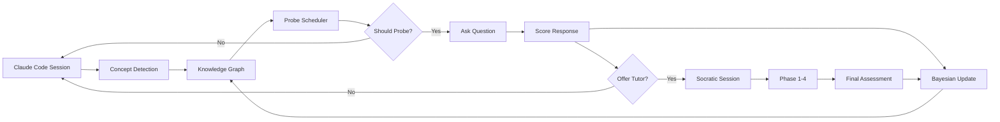

Entendi operates as a Claude Code plugin that tracks your learning in real-time. The system uses a five-stage pipeline to ensure you understand what you're building.

## The pipeline

<Steps>
  <Step title="Detect">
    ### Concept detection
    
    LLM-level concept detection identifies technical concepts from your conversation context. The system analyzes:
    
    - **Package imports** - Dependencies added to your project
    - **AST patterns** - Code structures from syntax trees
    - **LLM extraction** - Concepts mentioned in natural language
    
    Concepts are classified by domain (general, security, framework-specific) and specificity (topic, subtopic, concrete).
    
    <Note>
      Security domain concepts are automatically flagged as critical and receive higher probe probability.
    </Note>
  </Step>
  
  <Step title="Decide">
    ### Bayesian mastery tracking decides if a probe makes sense
    
    The system uses a **Graded Response Model (GRM)** with Fisher information to select the most informative concept to probe.
    
    ```typescript
    // From src/core/probe-scheduler.ts
    for (const c of candidates) {
      const fisherInfo = grmFisherInformation(c.mu, c.itemParams);
      const R = retrievability(c.daysSinceAssessment, c.stability);
      const decayBonus = 1 - R;
      const score = fisherInfo * (1 + decayBonus);
      
      if (score > bestScore) {
        bestScore = score;
        bestId = c.conceptId;
      }
    }
    ```
    
    **Novelty classification** determines probe probability:
    
    | Novelty level | Probe probability | When it applies |
    |---------------|-------------------|------------------|
    | `routine` | 5% | High mastery (>80%) + high retrievability (>70%) |
    | `adjacent` | 25% | Moderate mastery (>30%) |
    | `novel` | 60% | Never assessed or low mastery |
    | `critical` | 80% | Security domain concepts |
    
    **Rate limits** prevent overwhelming you:
    - Minimum 2 minutes between probes
    - Maximum 15 probes per hour
  </Step>
  
  <Step title="Probe">
    ### A question gets woven in naturally
    
    Questions are tailored to your user profile and the concept's novelty level:
    
    <CodeGroup>
    ```typescript Profile computation
    // From src/mcp/tools/observe.ts
    function computeUserProfile(kg: KnowledgeGraph, userId: string): UserProfile {
      const assessed = allConcepts.filter(c => {
        const ucs = kg.getUserConceptState(userId, c.conceptId);
        return ucs.assessmentCount > 0;
      });
      
      if (assessed.length === 0) return 'unknown';
      
      const avgMastery = assessed.reduce((sum, c) => {
        const ucs = kg.getUserConceptState(userId, c.conceptId);
        return sum + pMastery(ucs.mastery.mu);
      }, 0) / assessed.length;
      
      if (avgMastery > 0.75) return 'advanced';
      if (avgMastery > 0.4) return 'intermediate';
      return 'beginner';
    }
    ```
    
    ```typescript Intrusiveness mapping
    const INTRUSIVENESS_MAP: Record<UserProfile, Record<NoveltyLevel, Intrusiveness>> = {
      unknown:      { novel: 'direct',  adjacent: 'direct', routine: 'skip', critical: 'direct' },
      beginner:     { novel: 'direct',  adjacent: 'woven',  routine: 'skip', critical: 'direct' },
      intermediate: { novel: 'woven',   adjacent: 'woven',  routine: 'skip', critical: 'woven' },
      advanced:     { novel: 'woven',   adjacent: 'skip',   routine: 'skip', critical: 'woven' },
    };
    ```
    </CodeGroup>
    
    **Intrusiveness levels:**
    - `direct` - Explicit comprehension check
    - `woven` - Subtly integrated into conversation
    - `skip` - No probe (you've demonstrated mastery)
    
    **Probe depth** varies by novelty:
    
    | Depth | Focus | Guidance template |
    |-------|-------|-------------------|
    | 1 | Core purpose and basic usage | "Ask about the core purpose and basic usage of {concept}" |
    | 2 | Trade-offs and design decisions | "Ask about trade-offs and design decisions related to {concept}" |
    | 3 | Edge cases and failure modes | "Ask about edge cases and failure modes in {concept}" |
    
    Responses are scored on a **0-3 comprehension rubric**:
    
    - **0** - No understanding or incorrect
    - **1** - Partial understanding with gaps
    - **2** - Good understanding with minor gaps
    - **3** - Complete, accurate understanding
  </Step>
  
  <Step title="Teach">
    ### Low scores trigger a four-phase Socratic tutor
    
    When you score 0 or 1 on a probe, Entendi offers a tutoring session:
    
    <Tabs>
      <Tab title="Phase 1: Assess">
        **Goal:** Understand what you already know
        
        ```typescript
        // From src/mcp/tools/tutor.ts
        case 'phase1':
          return `Assess what the user already knows about ${conceptId}. 
                  Ask an open-ended question about their understanding.`;
        ```
        
        The tutor asks an open-ended question to gauge your baseline understanding. Your response is scored 0-3.
      </Tab>
      
      <Tab title="Phase 2: Guide">
        **Goal:** Build toward correct understanding
        
        ```typescript
        case 'phase2':
          return `Guide them toward deeper understanding of ${conceptId}. 
                  Identify gaps from their phase1 answer.`;
        ```
        
        Based on your phase 1 score, the tutor identifies gaps and guides you through the core concepts.
      </Tab>
      
      <Tab title="Phase 3: Correct">
        **Goal:** Address misconceptions
        
        ```typescript
        case 'phase3':
          if (misconception) {
            return `Address the misconception: "${misconception}". 
                    Help the user correct their understanding of ${conceptId}.`;
          }
          return `Deepen understanding of ${conceptId}. 
                  Address any remaining gaps or misconceptions.`;
        ```
        
        If misconceptions were detected, they're explicitly corrected. Otherwise, the tutor fills remaining gaps.
      </Tab>
      
      <Tab title="Phase 4: Verify">
        **Goal:** Confirm learning
        
        ```typescript
        case 'phase4':
          return `Ask for a comprehensive explanation of ${conceptId}. 
                  This is the final assessment.`;
        ```
        
        You're asked to explain the concept comprehensively. This final response is scored 0-3 and updates your mastery.
      </Tab>
    </Tabs>
    
    <Note>
      The tutor checks **Zone of Proximal Development** prerequisites. If foundational concepts aren't mastered, you'll get a suggestion to learn those first.
    </Note>
  </Step>
  
  <Step title="Track">
    ### Mastery updates through Graded Response Model with spaced repetition
    
    Every assessment (probe or tutor phase) updates your mastery using:
    
    <AccordionGroup>
      <Accordion title="Graded Response Model (GRM)">
        A psychometric model that uses your score (0-3) to update ability estimate (θ) and confidence (σ).
        
        ```typescript
        // From src/core/probabilistic-model.ts
        function bayesianUpdate(mastery: MasteryState, score: RubricScore): MasteryState {
          const { mu, sigma } = mastery;
          const expectedScore = 3 * pMastery(mu);
          const surprise = score - expectedScore;
          const K = (sigma * sigma) / (sigma * sigma + NOISE);
          const newMu = mu + K * surprise;
          const newSigma = sigma * Math.sqrt(1 - K);
          return { mu: newMu, sigma: newSigma };
        }
        ```
        
        - `mu` - Latent ability on the logistic scale
        - `sigma` - Uncertainty (decreases with more assessments)
        - Fisher information guides which concepts to probe next
      </Accordion>
      
      <Accordion title="FSRS-4.5 memory model">
        Tracks memory stability and forgetting curve:
        
        ```typescript
        // From src/core/probabilistic-model.ts
        const DECAY = -0.5;
        const FACTOR = 19 / 81;
        
        function retrievability(t: number, S: number): number {
          if (t <= 0) return 1.0;
          if (S <= 0) return 0.0;
          return (1 + FACTOR * t / S) ** DECAY;
        }
        ```
        
        - `S` - Stability (days until 90% retrievability)
        - `R` - Retrievability at time t
        - Updates on every successful recall
      </Accordion>
      
      <Accordion title="Time decay">
        Mastery estimates blend back toward prior uncertainty over time:
        
        ```typescript
        function decayPrior(mu: number, sigma: number, R: number): MasteryState {
          return {
            mu: R * mu + (1 - R) * PRIOR_MU,
            sigma: R * sigma + (1 - R) * PRIOR_SIGMA,
          };
        }
        ```
        
        As retrievability decreases, your mastery estimate becomes less certain.
      </Accordion>
      
      <Accordion title="Counterfactual tracking">
        The system tracks what *would have happened* if you'd been assessed differently, helping identify where your knowledge graph might have gaps.
      </Accordion>
    </AccordionGroup>
  </Step>
</Steps>

## Data flow



## Architecture

```
Claude Code ──► MCP Server (stdio) ──► HTTP API (Hono) ──► Neon PostgreSQL
                                         ▲
Dashboard (browser) ─────────────────────┘
```

**Hooks** (triggered by Claude Code):
- `SessionStart` - Injects concept-detection skill into every session
- `UserPromptSubmit` - Handles login detection, pending probes, teach-me patterns

**MCP Tools** (callable from Claude):
- `entendi_observe` - Process detected concepts, decide whether to probe
- `entendi_record_evaluation` - Update mastery from probe score
- `entendi_start_tutor` - Begin Socratic tutoring session
- `entendi_advance_tutor` - Move through tutor phases
- `entendi_dismiss` - Decline probe or tutor offer
- `entendi_get_status` - Check pending actions
- `entendi_get_zpd_frontier` - Get Zone of Proximal Development concepts
- `entendi_login` - Link Claude Code to Entendi account

## Next steps

<CardGroup cols={2}>
  <Card title="Philosophy" icon="lightbulb" href="/philosophy">
    Understand why comprehension accountability matters
  </Card>
  
  <Card title="Installation" icon="rocket" href="/installation">
    Get started with Entendi
  </Card>
</CardGroup>
